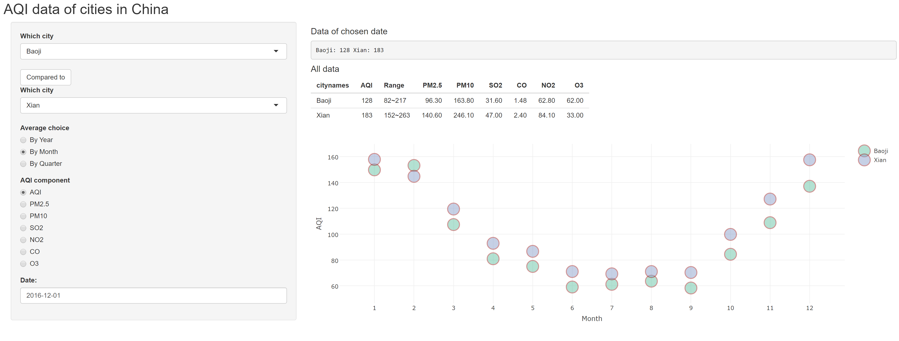

## Introduction
This app shows the historical air quality index (AQI) data of several cities in China.
Other than AQI data,  the app also shows the concentration of multiple pollutants. They are:  
**PM2.5**  
**PM10**  
**SO$_{2}$**  
**CO**  
**NO$_{2}$**  
**O$_{3}$**  

--- .class #id 

## Structure of data
The AQI data of all the cities are stored in CSV files and will be loaded upon chosen.  
  
The data can be plotted or shown in a table based on the choices of users.
For the plot, users can choose three average option: **By year**,**By month**,**By Quarter**.  
  
To show the details of the AQI data of a specific date, users can pick up a date by clicking on the **Date** UI component, then a data table should appear if the data of that date is avaiable.  
  
Users can also activite the **comparison** option by click **Compare to** button. Then,  data of both cities will be presented.  

--- 

## App snapshot

    

Try on:
https://tianyao1000.shinyapps.io/AQI_of_cities_in_China/

---
## Data source:
https://www.aqistudy.cn/historydata/index.php

